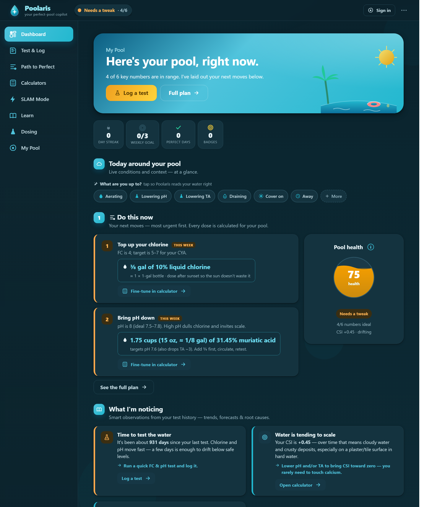
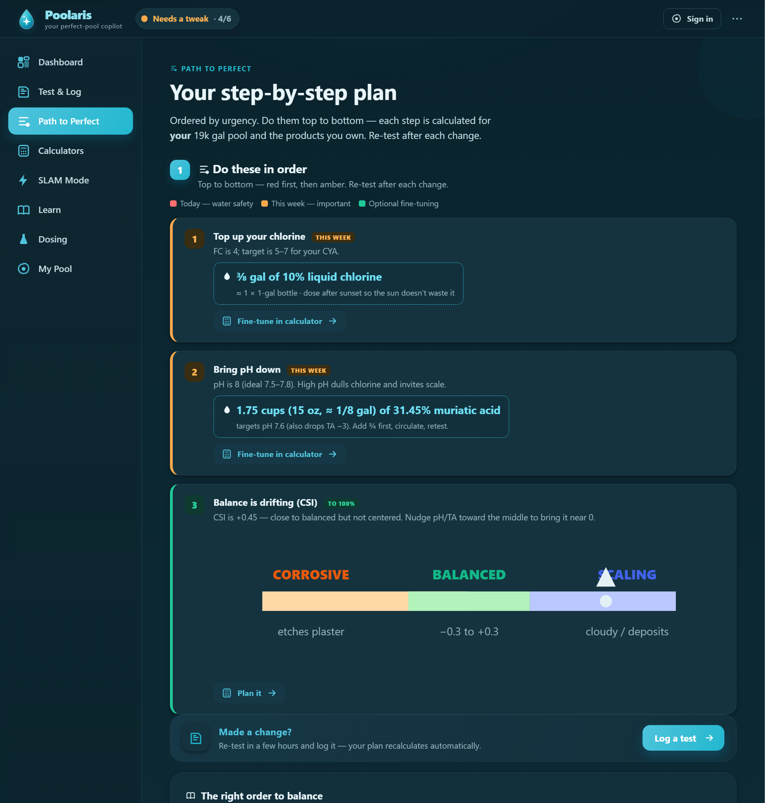
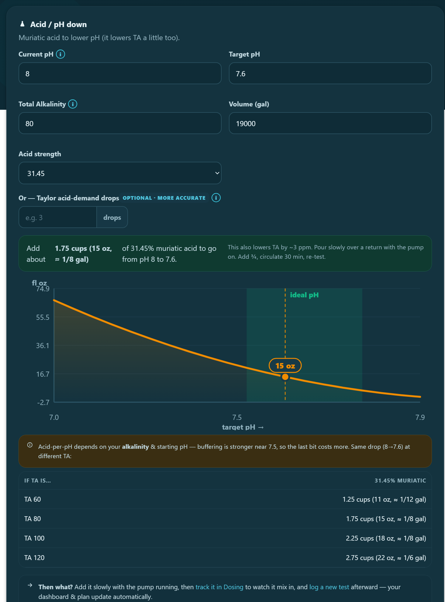

<div align="center">


# Poolaris

### Your North Star for a perfect pool. 🏊

**A guided, offline‑first pool‑care app built on the [Trouble Free Pool](https://www.troublefreepool.com/) (TFP) method.**
Log your water tests and it turns them into an exact, step‑by‑step plan — how much chlorine or acid to add, when to SLAM, your CSI, and what the weather is about to do to your chlorine.




</div>

---

## Why Poolaris

Pool stores guess and upsell. Poolaris does the chemistry **for** you — the same trusted TFP math, with every dose calculated for *your* pool and the products *you* own — and it works on your phone at the poolside with no internet, no account, and nothing to install.

- **No build step, no frameworks, no `npm install`.** The front end is plain HTML/CSS/vanilla JS.
- **No `pip`, no dependencies.** The backend is a single pure‑Python‑stdlib server (`http.server` + `sqlite3`).
- **Works fully offline** by opening one file — the server is only needed for multi‑device sync, accounts, the 24/7 watcher, and hosting.

## ✨ Features

- 🎯 **Exact next steps, ranked** — every test becomes a "do this now" plan with the precise dose in *your* product's strength (e.g. "¾ gal of 10% liquid chlorine").
- 🧪 **The full TFP toolkit** — FC/CYA targets, CSI water balance, a guided **SLAM** (algae kill) walkthrough, and 18+ calculators (chlorine, acid, CYA, CH, salt, dilution, volume…).
- ❤️ **One honest health score** — the dashboard tells you exactly what to fix to reach 100%; "dialed in" only ever means truly dialed in.
- 🌦️ **Weather‑aware** — forecasts rain dilution, heat‑wave burn‑off, and freeze risk (free, no API key).
- 🔔 **Always‑on 24/7 engine** — watches every pool and alerts on FC crashes, scaling, overdue tests, and weather — even when the app is closed.
- 📈 **Trends, forecasts & root causes** — chlorine‑burn projection, CYA staircase, and "why is my pH climbing?" insights from your own history.
- 🏢 **Optional multi‑tenant portal** — a pool‑service company can manage many client pools: roster, per‑tech routes, service visits, messaging, and reports.
- 📲 **Installable PWA** — add to your home screen; works offline as an app.

## 📸 A closer look

<table>
  <tr>
    <td width="50%" valign="top">
      <br />
      <sub><b>Path to Perfect</b> — every off number becomes an ordered step with the exact dose, plus an optional path to a perfect 100%.</sub>
    </td>
    <td width="50%" valign="top">
      <br />
      <sub><b>Calculators</b> — each tool shows the dose <i>and</i> the whole picture (here: acid needed vs. target pH, and how alkalinity changes it).</sub>
    </td>
  </tr>
</table>

## 🚀 Quick start

> On macOS/Linux the Python command is `python3`. On Windows it's `python`.

### Option A — Offline, one device (simplest)
Just open **`index.html`** in your browser (double‑click it, or *File ▸ Open*). Everything runs locally and your data is saved in that browser. Perfect for a single homeowner who doesn't need sync.

> Offline mode stores data in the browser. Clearing site data wipes it — use **My Pool ▸ Download backup** to keep a copy. (The installable PWA, accounts, and multi‑device sync require running the server, below.)

### Option B — Local server (sync + accounts + 24/7 engine)
From the project folder:

```bash
# macOS / Linux
python3 server.py

# Windows
python server.py        # or double-click run-poolaris.bat
```

Then open **http://localhost:8000**. The server auto‑opens your browser, runs the always‑on smart engine, and makes daily backups. Press **Ctrl‑C** to stop.

### Option C — Host it on the internet (macOS, via Cloudflare Tunnel)
```bash
brew install python cloudflared        # one time
chmod +x start-poolaris.command
./start-poolaris.command               # every run (or double-click in Finder)
```
This starts the server **bound to localhost only** and opens a Cloudflare Tunnel, printing a public `https://…` URL. See **[Hosting](#-hosting-on-the-internet)** for a stable hostname + login gate.

### Requirements

| To do this… | You need |
|---|---|
| Use it offline on one device | A modern browser (Chrome/Edge/Safari/Firefox). Nothing else. |
| Run the server (sync, accounts, 24/7 engine) | **Python 3.9+** — standard library only, no packages |
| Host it on the internet | [`cloudflared`](https://developers.cloudflare.com/cloudflare-one/connections/connect-networks/) (Cloudflare Tunnel) |
| Run the test suite | **Node.js** (only to cross‑check the JS chemistry engine against the Python one) |

---

## 👤 The two modes

Poolaris runs the same code in two modes and switches automatically:

1. **File mode (no accounts).** While no account has ever been created, the app reads/writes a single JSON file (`data/poolaris.json`). This is the offline, single‑user experience — `index.html` over `file://` and a fresh `python server.py` both use it.
2. **Account / portal mode.** The moment someone **signs up**, the server switches to per‑pool SQLite storage and the multi‑tenant portal turns on: login, multiple pools, a pool switcher, messaging, roster, technician routes, service visits, and reports.

**Homeowner vs. company:** at signup you choose *Homeowner* or *Pool service company*. Homeowners manage their own pool(s); companies get a roster, per‑tech routes, service‑visit logging, reports, and a join code for their technicians. Homeowners can connect to a company (join code) or **claim** a company‑created pool with an invite code.

---

## 🌐 Hosting on the internet

The app is designed to sit behind a reverse proxy that terminates TLS (Cloudflare Tunnel is the easiest). The server itself stays on `127.0.0.1` and is never exposed directly.

**Quick (ephemeral) URL** — `start-poolaris.command` already does this. Manually:
```bash
POOLARIS_NO_BROWSER=1 python3 server.py            # 127.0.0.1:8000
cloudflared tunnel --url http://127.0.0.1:8000     # prints a https://*.trycloudflare.com URL
```

**Stable hostname (one‑time):**
```bash
cloudflared tunnel login
cloudflared tunnel create poolaris
cloudflared tunnel route dns poolaris pool.yourdomain.com
export POOLARIS_TUNNEL_NAME=poolaris               # then run ./start-poolaris.command
```

**Strongly recommended for a public URL:**
- Put **Cloudflare Zero Trust → Access** (e.g. email OTP) in front of the hostname as a login gate. With Access you can even run account‑free (file mode) and your existing `data/poolaris.json` works as‑is.
- Keep the default bind (`127.0.0.1`) — do **not** set `POOLARIS_BIND_ALL`. Only the tunnel reaches the server.
- Cloudflare provides HTTPS at the edge; the server detects this (`X‑Forwarded‑Proto`) and automatically marks cookies `Secure` and sends HSTS. Rate‑limiting keys off the real visitor IP (`CF‑Connecting‑IP`).

---

## ⚙️ Configuration

All configuration is via environment variables — nothing is hardcoded.

| Variable | Default | Purpose |
|---|---|---|
| `POOLARIS_PORT` | `8000` | HTTP port |
| `POOLARIS_BIND_ALL` | _unset_ | `1` binds `0.0.0.0` (LAN access). Default is `127.0.0.1` (localhost only). |
| `POOLARIS_NO_BROWSER` | _unset_ | `1` skips auto‑opening a browser (for headless/hosted runs) |
| `POOLARIS_DB` | `data/poolaris.db` | SQLite database path |
| `POOLARIS_LEGACY_FILE` | `data/poolaris.json` | File‑mode JSON store (offline/no‑account data) |
| `POOLARIS_ENGINE` | `1` | `0` disables the always‑on 24/7 watcher |
| `POOLARIS_ENGINE_TICK` | `900` | Engine sweep interval, seconds |
| `POOLARIS_WEATHER` | `1` | `0` disables the server‑side weather poller |
| `POOLARIS_TUNNEL_NAME` | _unset_ | Named Cloudflare tunnel for `start-poolaris.command` (else a quick tunnel) |
| `POOLARIS_DEV` | _unset_ | `1` enables dev conveniences |

---

## 💾 Data, backups & logs

Everything lives under **`data/`** (which is never web‑served and is git‑ignored):

- `data/poolaris.db` — the SQLite database (WAL mode).
- `data/poolaris.json` — the file‑mode store (your offline/no‑account pool).
- `data/backups/poolaris-YYYYMMDD-HHMMSS.db` — automatic snapshots on startup and daily (an integrity check runs first; the last 14 are kept).
- `data/poolaris.log` — rotating server error log.
- `data/private/` — non‑served files.

**Back up your data** by copying `data/`, or in‑app via **My Pool ▸ Download backup** (a portable JSON you can restore on any device).

---

## 🗂️ Project structure

```
index.html              App shell + script tags (loads in dependency order)
styles.css              All styling (light/dark, tokens, responsive)
manifest.webmanifest    PWA manifest        sw.js   PWA offline service worker
icon.svg                App / maskable icon
pool-knowledge-base.md  The full TFP rulebook (downloadable in-app)

js/
  data.js        constants, ranges, dosing tables (with citations)
  calc.js        the verified chemistry engine (FC/CYA, CSI, acid, doses)
  insights.js    smart observations (FC burn forecast, trends, root causes)
  weather.js     Open-Meteo forecast + pool-care warnings (no API key)
  chem.js        dosing tracker + "mixing in" projection
  charts.js      token-driven SVG charts with ideal-range bands
  svg.js         inline SVG icon + diagram library
  engage.js      streaks, badges, celebrations, money-saved
  activities.js  context layer ("are you aerating?") + guided campaigns
  api.js         fetch client: session, CSRF, offline outbox
  portal.js      multi-tenant UI: login, switcher, messaging, roster, route, visits
  app.js         the SPA: routing, render, boot, state

server.py     pure-stdlib HTTP server + REST API
auth.py       SQLite schema, crypto (pbkdf2), sessions, CSRF, authorization
engine.py     the always-on 24/7 watcher (daemon thread)
chem.py       Python mirror of calc.js (kept in sync via the golden test)
weather.py    server-side weather poller (stdlib urllib)
test_chem.py  golden cross-check: asserts chem.py == calc.js

run-poolaris.bat        Windows launcher
start-poolaris.command  macOS launcher (server + Cloudflare Tunnel)
```

---

## 🏗️ Architecture notes

- **Offline‑first is sacred.** Opening `index.html` with no server must always work. The portal layer (`api.js`) is inert until a server + account exist.
- **The chemistry engine is verified and shared.** `calc.js` (browser) and `chem.py` (server) are a matched pair; `test_chem.py` shells out to Node and asserts they produce identical numbers (70 golden checks) so the dashboard and the 24/7 engine can never disagree.
- **The 24/7 engine** (`engine.py`) runs as a crash‑isolated daemon thread with its own WAL connection. It re‑evaluates every pool on a schedule, writes deduped/snoozable alerts, polls weather, and posts system messages. Disable with `POOLARIS_ENGINE=0`.
- **Weather** uses Open‑Meteo (free, no key) — client‑side for the dashboard and server‑side for 24/7 alerts. Degrades silently with no internet.

---

## 🔒 Security posture

- Same‑origin only (no CORS `*`); Origin/Referer checked on every mutation (the localhost allowance is gated on the bind address).
- `httpOnly` session cookie + a session‑bound CSRF token required on every write.
- Per‑pool authorization (default‑deny); parameterized SQL everywhere; column allowlists.
- Passwords hashed with pbkdf2‑sha256 (600k rounds); a common‑password denylist; rate‑limiting on login, signup (before hashing), messaging, and joins.
- Static **allowlist** — only real app assets are served; the DB, source, `data/`, and notes return 404.
- Security headers on every response: `Content‑Security‑Policy`, `X‑Frame‑Options: DENY`, `Referrer‑Policy`, `X‑Content‑Type‑Options`, plus HSTS + `Secure` cookies when behind HTTPS.
- Automatic SQLite backups + startup integrity check.

> For a single‑homeowner public deployment, adding Cloudflare Access (or another auth gate) in front is still the strongest move.

---

## 🧪 Development & tests

```bash
# Chemistry parity (browser engine == server engine) — needs Node + Python
python3 test_chem.py            # → "ALL GOLDEN CROSS-CHECKS PASSED"

# Quick syntax checks
for f in js/*.js; do node --check "$f"; done
python3 -m py_compile server.py engine.py chem.py auth.py weather.py
```

No bundler or transpiler is involved — edit a file and reload. Scripts load in dependency order in `index.html` (data → calc → charts → api → insights → weather → chem → engage → activities → app → portal).

If you change any chemistry constant, update **both** `calc.js`/`data.js` and `chem.py`, then re‑run `test_chem.py`.

---

## 🛟 Troubleshooting

- **Port already in use** → `POOLARIS_PORT=8010 python3 server.py`.
- **`python: command not found` (macOS)** → use `python3`, or `brew install python`.
- **Opened `index.html` but there's no login / sync** → that's by design; `file://` is the offline mode. Run `python server.py` and use `http://localhost:8000` for accounts/portal.
- **A code change isn't showing up** → hard‑reload (`Ctrl/Cmd+Shift+R`); the PWA service worker caches the app shell. If stubborn: DevTools ▸ Application ▸ Service Workers ▸ Unregister, then reload.
- **PWA "Install" doesn't appear** → install is only offered over the server/HTTPS, not `file://`.
- **Weather widget empty** → it needs internet and a recognizable region in your pool profile; it degrades silently otherwise.
- **Lost data after clearing the browser (offline mode)** → restore from a **Download backup** JSON, or copy `data/poolaris.json`. (Always keep a backup.)

---

## 📄 License

**Proprietary — © 2026 Poolaris. All rights reserved.** The source is published for reference and evaluation only; it is **not** open‑source. No use, copying, modification, distribution, hosting, or sale is permitted without prior written permission. See [`LICENSE`](LICENSE).

## Credits

Built on the **[Trouble Free Pool](https://www.troublefreepool.com/)** (TFP) methodology. Poolaris is an independent tool and is not affiliated with or endorsed by TFP. Weather by [Open‑Meteo](https://open-meteo.com/).
